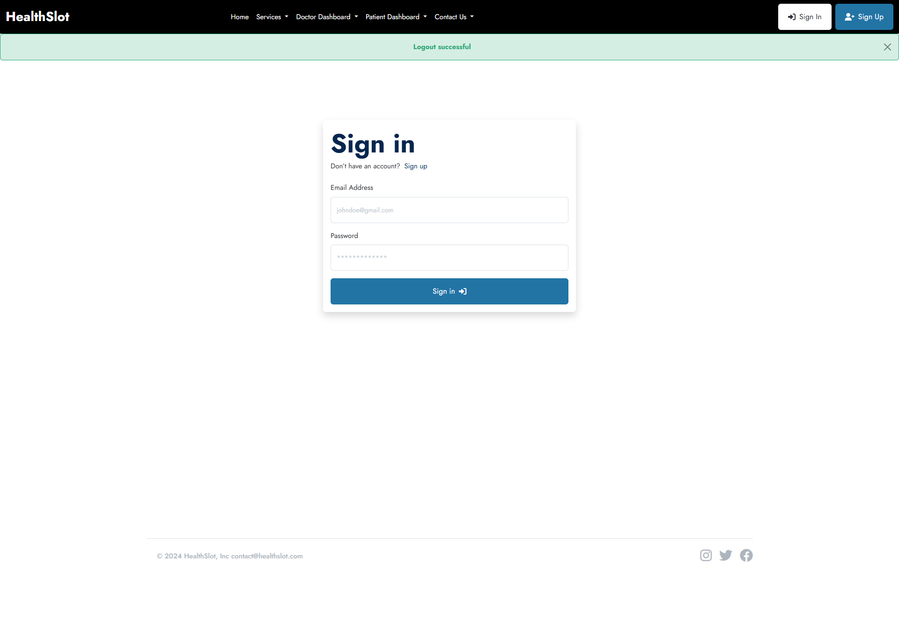

# Health Slot Health Management System

<h1>Project Overview</h1>

This project is designed to help me mastering the core features of python while building a fully functional health appointment web application. From secure authentication to payment integrations, this system allows both doctors and patients to easily manage their appointments, access health services, and utilize role-based account management. By integrating various services and features, this project help me understand how to build complex web applications while providing real-world functionality.

<h1>Key Features</h1>
<h2>Secure Authentication</h2>

 Implement a secure login system for doctors and patients with role-based access control, ensuring privacy and data security.
Account Management: Create and manage user accounts with specific roles (doctor, patient) and permissions for different access levels.

<h2>Account Management</h2>

Create and manage user accounts with specific roles (doctor, patient) and permissions for different access levels.
Service Listings: Easily manage and display healthcare services (e.g., consultations, diagnostics, etc.) offered by doctors.
Appointment Scheduling: Build a system that allows patients to book appointments with doctors, view available slots, and manage appointments.
Payment Integration: Integrate Stripe and PayPal for secure and seamless payment processing, enabling patients to pay for appointments online.

<h2>Dasboard Admin</h2>

Service Listings: Easily manage and display healthcare services (e.g., consultations, diagnostics, etc.) offered by doctors.
Appointment Scheduling: Build a system that allows patients to book appointments with doctors, view available slots, and manage appointments.
Payment Integration: Integrate Stripe and PayPal for secure and seamless payment processing, enabling patients to pay for appointments online.
Dynamic Dashboards: Develop interactive dashboards for both doctors and patients to manage their profiles, appointments, and services.
Admin Panel: Customize the Django admin interface to manage users, appointments, and health services with a simple, efficient back-end.
Email Integrations: Learn how to send automated emails for appointment confirmations, reminders, and updates using Django’s email system. You'll also learn how to configure API keys and email domains.

# 💻 Tech Use:
           

<picture>
  <source media="(prefers-color-scheme: dark)" srcset="https://raw.githubusercontent.com/tobiasmeyhoefer/tobiasmeyhoefer/output/github-snake-dark.svg" />
  <source media="(prefers-color-scheme: light)" srcset="https://raw.githubusercontent.com/tobiasmeyhoefer/tobiasmeyhoefer/output/github-snake.svg" />
  
</picture>
